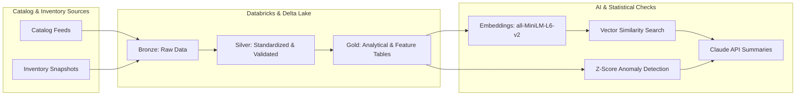

```mermaid
flowchart LR
  subgraph Sources["Catalog & Inventory Sources"]
    CAT["Catalog Feeds"]
    INV["Inventory Snapshots"]
  end

  subgraph Lakehouse["Databricks & Delta Lake"]
    B["Bronze: Raw Data"]
    S["Silver: Standardized & Validated"]
    G["Gold: Analytical & Feature Tables"]
  end

  subgraph Intelligence["AI & Statistical Checks"]
    EMB["Embeddings: all-MiniLM-L6-v2"]
    VEC["Vector Similarity Search"]
    Z["Z-Score Anomaly Detection"]
    LLM["Claude API Summaries"]
  end

  CAT --> B
  INV --> B
  B --> S --> G
  G --> EMB --> VEC
  G --> Z
  VEC --> LLM
  Z --> LLM
```
