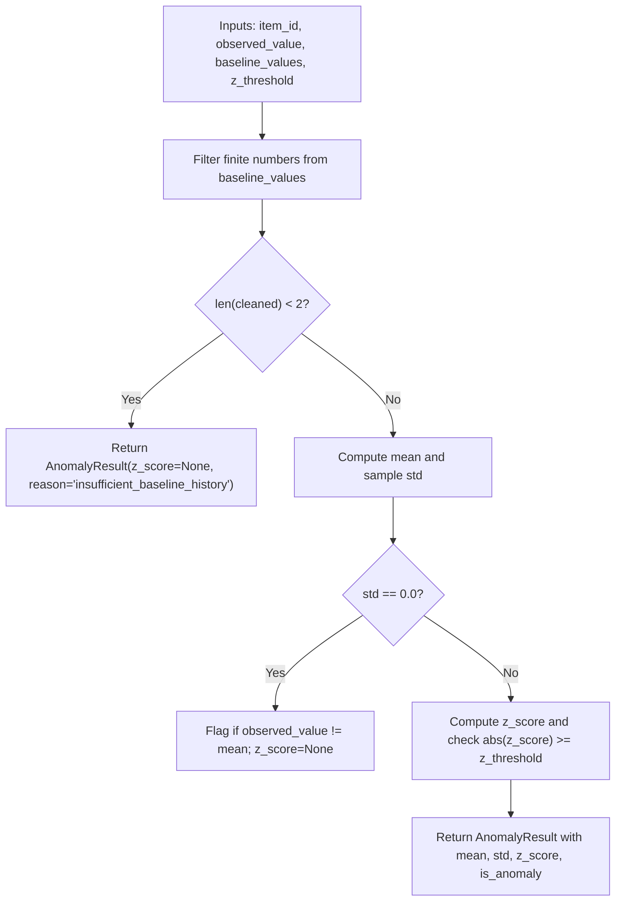

# Signals Execution Flow (`src/intelligence/signals.py`)

```mermaid
flowchart TD
  A["Inputs: item_id, observed_value, baseline_values, z_threshold"] --> B["Filter finite numbers from baseline_values"]
  B --> C{"len(cleaned) < 2?"}
  C -- Yes --> D["Return AnomalyResult(z_score=None, reason='insufficient_baseline_history')"]
  C -- No --> E["Compute mean and sample std"]
  E --> F{"std == 0.0?"}
  F -- Yes --> G["Flag if observed_value != mean; z_score=None"]
  F -- No --> H["Compute z_score and check abs(z_score) >= z_threshold"]
  H --> I["Return AnomalyResult with mean, std, z_score, is_anomaly"]
```
